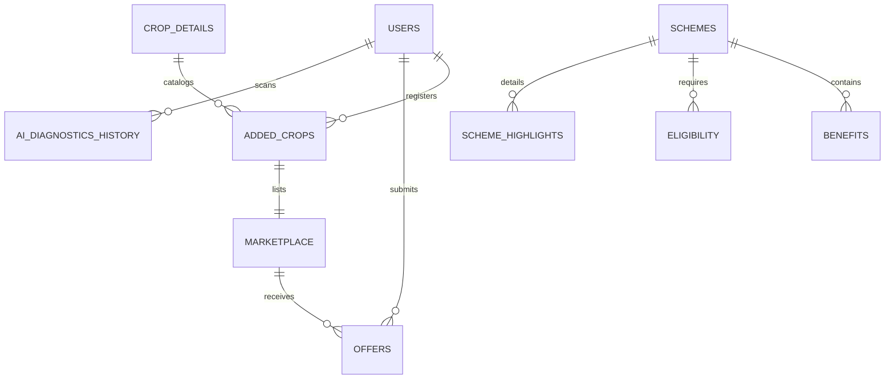

# AgriConnect: Humanoid Agriculture Marketplace, Database & AI
### University of Mianwali – CSC-271 Database & Web Systems Project
---

**AgriConnect** is an advanced, localized digital marketplace and agricultural intelligence system. It directly bridges the gap between rural farmers and buyers, eliminating exploitative middlemen, introducing pricing transparency, and providing farmers with client-side AI crop disease diagnostics, local market statistics, and a consolidated directory of government aid schemes.

---

## 🚀 Key Features

1. **Dual-Sided Marketplace & Negotiation Engine**:
   - **Farmers** can catalog harvests, list pricing, manage inventory, and track buyer interest (clicks).
   - **Buyers** can search available listings, submit custom negotiation offers with target pricing and messages, and monitor offer states (*pending*, *accepted*, *rejected*).
2. **Client-Side AI Perceptual Disease Diagnostics**:
   - Completely offline-capable image analysis running directly in the browser via canvas analysis.
   - Uses RGB color histograms, intensity thresholds, and variance standard deviation to map leaves and fruits to 15+ crop diseases, returning bilingual treatments (English & Urdu).
3. **Market Intelligence & Price Predictor**:
   - Displays localized crop prices, yields, and demand profiles across Mianwali's sub-districts (*Isa Khel*, *Piplan*, *Kalabagh*, *Kundian*, *Daudkhel*, *Wan Bhachran*, *Mianwali City*).
4. **Government Schemes Directory**:
   - A normalized, active directory detailing provincial (Punjab) and federal subsidies, tractor balloting, solar tube-well schemes, Kissan cards, and interest-free loans.
5. **Secure Authentication & Migration**:
   - Custom cryptographically-signed authorization tokens (JWT-equivalent) with automatic, transparent hashing migration (plain-text to bcrypt) upon farmer/buyer login.

---

## 🛠️ Technology Stack

| Layer | Technology | Purpose |
| :--- | :--- | :--- |
| **Frontend** | HTML5, Vanilla JavaScript (ES6), Custom HSL CSS, CSS Grid/Flexbox | Fast SPA router, state container, dynamic widgets, and chart visualizations. |
| **Styling** | Vanilla CSS (Glassmorphic dark/light UI, custom micro-animations) | Responsive mobile-first interface optimized for field use. |
| **Backend** | PHP 8.x (Strict types, raw PDO, prepared statements) | Lightweight JSON REST API, token verification, input sanitization. |
| **Database** | MySQL 8.0 / MariaDB (InnoDB, Foreign Key Cascades) | Normalized relational schema for transactions, users, and diagnostics. |
| **AI Engine** | HTML5 Canvas API (ImageData buffer analysis) | Client-side visual feature extraction and heuristic prediction profile. |

---

## 📁 Codebase Directory Structure

```
Humanoid Agriculture Marketplace Database AI/
├── index.html                # App Entry Point & Script Bootstrapper
├── README.md                 # System Technical Documentation
├── TEST_GUIDE.md             # Manual curl-based API testing references
├── FIX_DOCUMENTATION.md      # Historical details of Crop Detection Bugfix
├── test_agriconnect.py       # Executable Python Integration & AI Engine test suite
├── assets/
│   └── logo.png              # System branding logo
├── css/
│   └── styles.css            # Main stylesheet (Glassmorphism, Dark/Light theme, Animations)
├── js/
│   ├── main.js               # Legacy SPA script (unused, kept for modular migration references)
│   ├── data.js               # Static UI labels and configuration definitions
│   ├── ai-disease.js         # Core Client-side Perceptual Disease Engine
│   ├── app.js                # Router, Auth workflows, state store, and pages renderer
│   └── dashboard.js          # Farmer & Buyer dashboard render logic, charts, and interactive modals
├── php/
│   ├── api.php               # Main REST API controller (routing, authentication, database CRUD)
│   ├── setup.php             # Database setup, table creations, auto-migrations, and seeds
│   ├── apply_sql.php         # Developer command utility to run raw SQL
│   ├── drop_tables.php       # Developer utility to clean database schemas
│   ├── run_sql.php           # DB setup bootstrap
│   └── run_regional_sql.php  # Inserts regional stats seed data
└── sql/
    ├── database.sql          # Primary database schema tables & seed records
    ├── cropdb.sql            # Supplemental crop rules
    ├── intelligence.sql      # Historical price data for market predictor
    ├── intelligence_deep.sql # Extra historical data
    ├── mianwali_data.sql     # Local regional crop data
    ├── regional_data.sql     # Sub-district price charts
    ├── schemes.sql           # Government schemes schema structure
    └── schemes_data.sql      # Detailed government schemes seed rows
```

---

## 🗄️ Database Schema Details

The database is normalized to eliminate redundancy and uses **InnoDB** with **Foreign Key Cascades** to enforce referential integrity.



### Table Breakdown

#### 1. `users`
Stores accounts with roles mapping system access.
- `id` (INT, Primary Key, Auto-Increment)
- `name` (VARCHAR)
- `email` (VARCHAR, Unique Index)
- `password` (VARCHAR, Bcrypt hashed)
- `role` (ENUM: `'farmer'`, `'buyer'`, `'admin'`)
- `phone` (VARCHAR)
- `location` (VARCHAR)
- `is_approved` (TINYINT(1), Default: `0`, Admins must approve farmers/buyers)
- `created_at` (TIMESTAMP)

#### 2. `crop_details`
Descriptive catalogue of crops.
- `id` (INT, Primary Key)
- `name` (VARCHAR)
- `category` (VARCHAR - e.g., Grain, Fruit, Vegetable)
- `description` (TEXT)

#### 3. `added_crops`
Farmer inventory logging harvested quantities.
- `id` (INT, Primary Key)
- `farmerId` (INT, Foreign Key referencing `users(id)`)
- `cropDetailId` (INT, Foreign Key referencing `crop_details(id)`)
- `quantity` (INT)
- `unit` (VARCHAR, Default `'kg'`)
- `harvestDate` (DATE)
- `addedDate` (TIMESTAMP)

#### 4. `marketplace`
Active public listings available for negotiation.
- `id` (INT, Primary Key)
- `addedCropId` (INT, Foreign Key referencing `added_crops(id)`)
- `price` (DECIMAL(10,2) - Unit Price)
- `location` (VARCHAR)
- `status` (ENUM: `'available'`, `'sold'`, `'archived'`)
- `listedDate` (DATE)
- `clicks` (INT) - Tracks listing interest level
- `farmer_name` (VARCHAR), `farmer_city` (VARCHAR), `farmer_phone` (VARCHAR) - Cached for rapid retrieval

#### 5. `offers`
Negotiation bids placed by buyers on marketplace listings.
- `id` (INT, Primary Key)
- `marketplaceId` (INT, Foreign Key referencing `marketplace(id)`)
- `buyerId` (INT, Foreign Key referencing `users(id)`)
- `offeredPrice` (DECIMAL(10,2))
- `status` (ENUM: `'pending'`, `'accepted'`, `'rejected'`)
- `date` (DATE)
- `message` (TEXT)

#### 6. `diseases`
Static rule library containing diagnostic metrics, Urdu translations, and treatment recommendations.
- `id` (INT, Primary Key)
- `name` (VARCHAR - e.g., 'Wheat Rust')
- `ur_name` (VARCHAR - Urdu name)
- `crop` (VARCHAR - target crop category)
- `type` (VARCHAR - Fungal, Bacterial, Viral)
- `symptoms` (TEXT) / `ur_symptoms` (TEXT)
- `treatment` (TEXT) / `ur_treatment` (TEXT)
- `severity` (VARCHAR - Low, Medium, High, Very High)
- `image` (VARCHAR - reference image URL)
- `condition_name` (VARCHAR, Default `'Diseased'`)

#### 7. `ai_diagnostics_history`
History of scans performed by farmers.
- `id` (INT, Primary Key)
- `farmerId` (INT, Foreign Key referencing `users(id)` ON DELETE SET NULL)
- `disease_name` (VARCHAR)
- `confidence` (DECIMAL(5,2))
- `crop` (VARCHAR)
- `scan_date` (TIMESTAMP)

#### 8. `regional_stats`
Local sub-district agricultural price and crop yield references.
- `id` (INT, Primary Key)
- `region` (VARCHAR)
- `crop_name` (VARCHAR)
- `avg_price` (DECIMAL(10,2))
- `demand_level` (INT)
- `avg_yield` (VARCHAR)

#### 9. `schemes`, `benefits`, `eligibility`, `scheme_highlights`
Normalised layout for managing government aids and criteria indices.

---

## 🔍 Code Walkthrough & Logic Definitions

### 1. Client-Side AI Perceptual Engine (`js/ai-disease.js`)
To run AI diagnosis instantly on low-powered mobile devices in rural fields without internet dependencies, AgriConnect bypasses heavy PyTorch/TensorFlow server requests by analyzing color-space distributions directly on the client.

#### Feature Extraction via HTML5 Canvas
When an image is loaded, it is downscaled onto a $30 \times 30$ pixel canvas to filter noise and accelerate analysis.
```javascript
const canvas = document.createElement('canvas');
canvas.width = 30;
canvas.height = 30;
const ctx = canvas.getContext('2d');
ctx.drawImage(imgElement, 0, 0, 30, 30);
const imgData = ctx.getImageData(0, 0, 30, 30);
const data = imgData.data;
```
It iterates over the image buffer (`Uint8ClampedArray`), summing colors and classifying pixels based on RGB ratios:
- **Greenness**: $G > R \text{ and } G > B$
- **Yellowness (Chlorosis/Spots)**: $R > 120 \text{ and } G > 120 \text{ and } B < 100$
- **Brownness (Necrosis/Rust/Rot)**: $R > G \text{ and } R > 60 \text{ and } G > 30 \text{ and } B < 60$

#### Similarity Matching Formula
If the disease profile has a reference image available, the engine extracts the reference features and calculates similarity using weighted Euclidean Manhattan distances:
$$\text{ColorDiff} = |R_{uploaded} - R_{ref}| + |G_{uploaded} - G_{ref}| + |B_{uploaded} - B_{ref}|$$
$$\text{Similarity} = 100 - (\text{ColorDiff} \times 0.15 + \Delta\text{Yellow} \times 80 + \Delta\text{Green} \times 80 + \Delta\text{Brown} \times 80)$$

If the reference image loading fails, the system falls back to matching predefined heuristic profiles:
- **Healthy Profile**: Greenness $\approx 0.8$, Yellowness $\approx 0.05$, Brownness $\approx 0.05$
- **Rust/Rot/Blight Profile**: Brownness $\approx 0.45$, Greenness $\approx 0.20$
- **Mildew/Yellowing Profile**: Yellowness $\approx 0.40$, Greenness $\approx 0.25$

---

### 2. Backend REST API (`php/api.php`)

#### JWT-equivalent Token Session Manager
The backend implements stateless token verification. Tokens are generated upon successful login:
```php
private function generateToken(array $user): string {
    $payload = [
        'id' => $user['id'],
        'role' => $user['role'],
        'exp' => time() + (86400 * 30) // 30 Days expiration
    ];
    $payloadEnc = base64_encode(json_encode($payload));
    $signature = hash_hmac('sha256', $payloadEnc, self::SECRET_KEY);
    return $payloadEnc . '.' . $signature;
}
```
The token is verified in request lifecycles by checking `HTTP_AUTHORIZATION` and re-computing the HMAC signature:
```php
$expectedSig = hash_hmac('sha256', $payloadEnc, self::SECRET_KEY);
if (hash_equals($expectedSig, $signature)) { ... }
```

#### Transparent Cryptographic Migration
The system securely migrates deprecated plaintext user databases to modern standard `bcrypt` hashing on-the-fly when logins occur:
```php
if (password_verify($password, $user['password'])) {
    // Standard bcrypt validated
    ApiResponse::success(['user' => $user]);
} elseif ($user['password'] === $password) {
    // Plaintext match: Upgrade user hash immediately
    $newHash = password_hash($password, PASSWORD_DEFAULT);
    $updateStmt = $this->db->prepare("UPDATE users SET password = ? WHERE id = ?");
    $updateStmt->execute([$newHash, $user['id']]);
    ApiResponse::success(['user' => $user]);
}
```

---

## ⚙️ Local Setup & Deployment

### Prerequisites
- **XAMPP** (with Apache, PHP 8.x, and MySQL/MariaDB) installed.
- **Python 3.10+** (if you wish to execute tests or regenerate documentation).

### Step-by-Step Installation

1. **Clone/Move Project to htdocs**:
   Place the project directory inside `C:\xampp\htdocs\Humanoid Agriculture Mrketplace  Database  AI`.

2. **Start Servers via XAMPP Control Panel**:
   - Open XAMPP and click **Start** next to **Apache** and **MySQL**.

3. **Initialize Database and Schema Setup**:
   AgriConnect handles database migrations automatically. 
   - Open your web browser and navigate to: `http://localhost/Humanoid Agriculture Mrketplace  Database  AI/php/setup.php`.
   - This script will drop any conflicting tables, create the `agriconnect` database, provision the structured schemas, run migrations, and populate seed data.
   - Alternatively, you can import `sql/database.sql` directly into PHPMyAdmin.

4. **Access UI Interface**:
   - Open: `http://localhost/Humanoid Agriculture Mrketplace  Database  AI/index.html` in your browser.

---

## 🧪 Testing and Verification

### Automated Integration and AI Tests

The project includes an executable Python script `test_agriconnect.py` designed to verify API health, endpoint transactions, and the AI diagnostic matching engine.

#### Run Tests
Ensure you have the `requests` library installed (`pip install requests`) and that Apache/MySQL is running, then run:
```powershell
python test_agriconnect.py
```

#### Verification Coverage
- **Server Connectivity**: Verifies port availability and DB connection.
- **Authentication Lifecycle**: Simulates registering a new user, logging in, verifying token extraction, and testing invalid credentials.
- **Inventory & Bidding Flows**: Tests adding a crop listing, fetching the synchronized marketplace data, and posting buyer bids.
- **AI Math Models**: Directly unit-tests the color extraction logic using mock matrices to verify diagnosis similarity scores.

---

## 📜 Academic Attribution
- **University**: University of Mianwali (UOM)
- **Course**: CSC-271 Database Systems / Web Technologies
- **System Version**: 1.2.0 (Fully Operational & Seeded)
